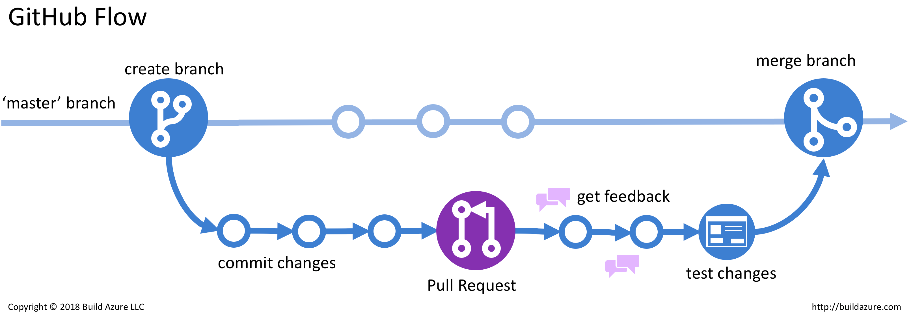

# Custom Helm 배포 방법

## Workflow

Flow 베이스는 Github Flow를 토대로 한다.

[ Dev, Stg 환경 ]
1. [Jira](https://acme.atlassian.example/jira/software/c/projects/PROJ/boards/1) 이슈 생성
2. 생성 된 [Jira](https://acme.atlassian.example/jira/software/c/projects/PROJ/boards/1) 이슈 ID를 통해서 Git Branch를 생성한다.
    - ex) PROJ-1
3. 생성 된 Git Branch를 통해서 작업을 진행하고 커밋, 푸시를 진행한다.
4. ArgoCD 어플리케이션 소스에 접근해 TergetRevision을 변경한다.
- ArgoCD URL
  - [Dev](https://argocd-mall.dev.acme.example/)
  - [Stg](https://argocd-mall.stg.acme.example/)
  - [Prd](https://argocd-mall.acme.example/)
- ````yaml
  - repoURL: 'https://github.com/AcmeCorp/manifest-k8s-acme-cluster.git'
    path: acmemall-backend-v4/batch
    targetRevision: master -> <원하고자 하는 브랜치 명>
  ````
5. ArgoCD 어플리케이션 Sync가 진행되는지 확인.
6. ArgoCD 어플리케이션 Sync가 완료되면 배포가 완료된다.
7. PR을 통해서 코드 리뷰를 진행한다.
8. 코드 리뷰가 완료되면 Merge를 진행한다.

[ Prd 환경 ]
1. [Jira](https://acme.atlassian.example/jira/software/c/projects/PROJ/boards/1) 이슈 생성
2. 생성 된 [Jira](https://acme.atlassian.example/jira/software/c/projects/PROJ/boards/1) 이슈 ID를 통해서 Git Branch를 생성한다.
    - ex) PROJ-1
3. 생성 된 Git Branch를 통해서 작업을 진행한다.
4. 작업이 완료되면 Pull Request를 생성한다.
5. Pull Request를 통해서 코드 리뷰를 진행한다.
6. 코드 리뷰가 완료되면 Merge를 진행한다.
7. Merge가 완료되면 ArgoCD를 통해서 배포를 진행한다.


